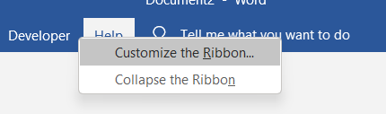
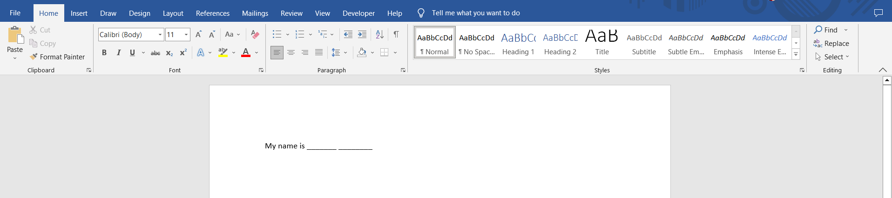
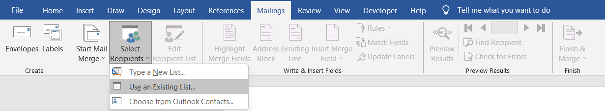
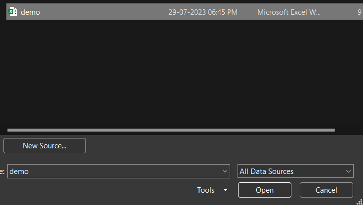
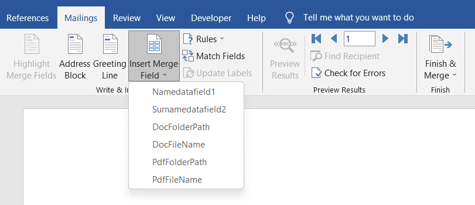
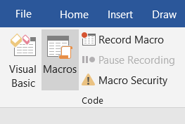
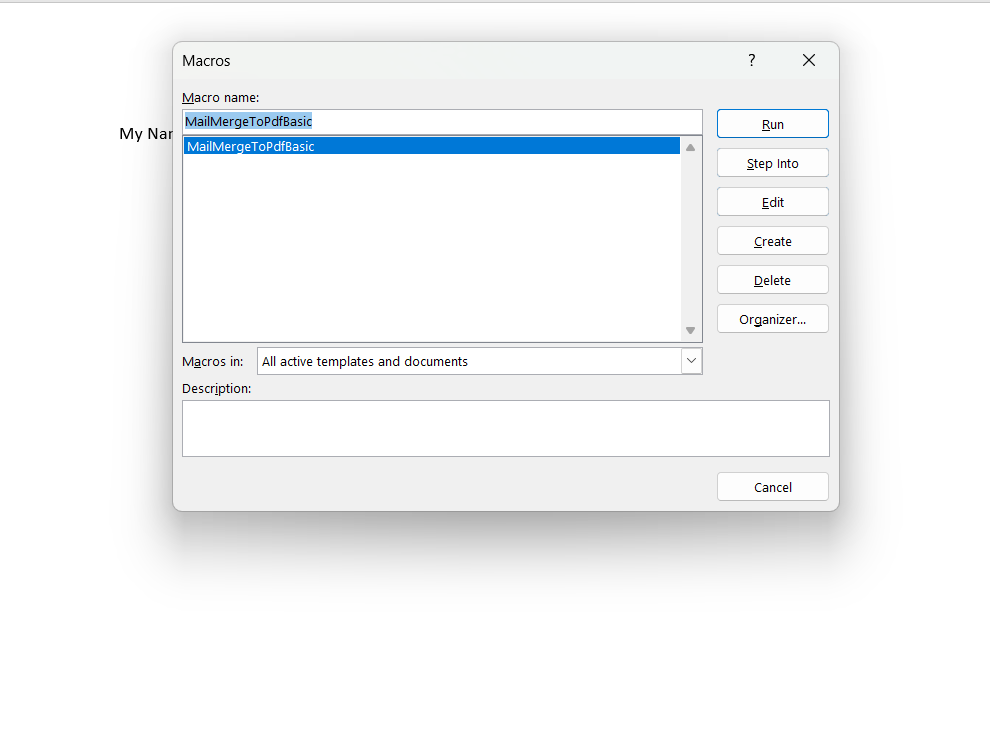
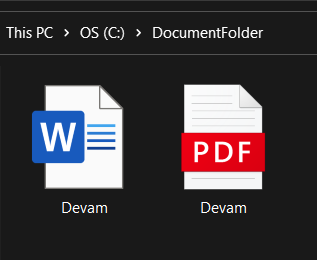

# MailMerge_WordDocx_to_PDF

After Mail Merge , Document only create in .docx format in MSWord . So this can help you to covert that MailMerge Document into .pdf format

# Step 1

Open MS Word and right click on Menubar and open customize the Ribbon..

# Step 2

Checked Developer box and Save Settings

# Step 3

Open Developer Menu in MS Word and Open Visual Basic

# Step 4

Open Insert and Open Module

# Step 5

Add code.vb in this module (just copy and paste)

# Step 6

Just save module settings and open new MS word file

# Step 7

Create a excel file for MailMerge, add column as per your needs but add complusory 4 column in that excel file (DocFolderPath , DocFileName , PdfFolderPath , PdfFileName).
In above 4 columns , you should add DocFolderPath where your .docx file will be saved ,also should add PdfFolderPath where your .pdf file will be saved.
In DocFileName and PdfFileName , set name as per your needs.
Save the excel file(demo.xlsx)

# Step 8

Open Mailings and select Select Recipients and choose Use an Existing List...

# Step 9

After that , insert datafield as per your need.

Use datafield like this...
e.g.

# Step 10

Open Developer Tab and Select Macros

# Step 11

Hit Run Button !!

And finally that file created in your desire folder

